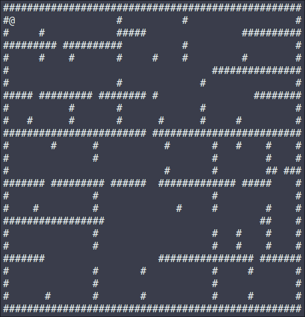
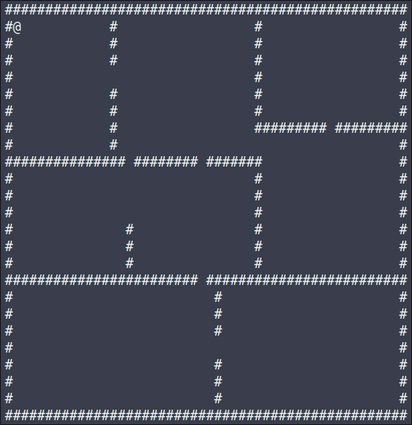

# BSP Dungeon Generator
Simple implementation in C of a dungeon generator using the Binary Space Partitioning (BSP)

## Demo

Supplied is a small demo, which will generate a dungeon and a player character, which can moved around using the W, A, S, D keys. Demo can be exited by pressing the X key.

### Prerequisities for compiling:

```CMake or GNU Make, ncurses```

### Compiling the demo executable:

```utf-8
# The showcase demo can be built using CMake:
mkdir build && cd build
cmake ..
cmake --build .

# And then run using:
./demo

# Or using GNU Make:
make

# And then run using:
./build/demo
```

## Modifiability

Dungeon generation can be altered by changing these macros:

```C++
#define MAX_X 50                // Max base room width
#define MAX_Y 25                // Max base room height
#define UINT_CHANGEABLE uint8_t // Changeable data type if needed to generate larger maps than 0-255
#define PSEUDO_ROOM_SIZE 4      // Pseudo max room size
#define CORNER_TILE '#'         // Corner tile character
#define WALL_TILE '#'           // Wall tile character
#define WALKABLE_TILE ' '       // Walkable tile character
```

## Usage

In your source code, you need to include the ```.h``` file from the ```include``` directory. After that map can be generated like this:

```C++
map generated_map = generate_dungeon();
```

This generates the map and stores in the ```map``` struct which contains a ```tiles``` array.

```C++
typedef enum tiles
{
    Walkable,
    Corner,
    Wall
} tiles;

typedef struct map
{
    tiles tiles[MAX_X][MAX_Y];
} map;
```

Map can then be printed using:

```C++
dump_dungeon(&generated_map);
```
### Important note:
 Map is drawn using ncurses. If you desire to draw it other way, alter the ```dumb_dungeon()``` function.

```C++
void dump_dungeon(map *map)
{
    char drawn_tile;
    for (int x = 0; x < MAX_X; x++)
        for (int y = 0; y < MAX_Y; y++)
        {
            switch (map->tiles[x][y])
            {
            case Corner:
                drawn_tile = CORNER_TILE;
                break;
            case Wall:
                drawn_tile = WALL_TILE;
                break;
            case Walkable:
                drawn_tile = WALKABLE_TILE;
                break;
            default:
                break;
            }
            mvprintw(y, x, "%c", drawn_tile);
        }
}
```

## Screenshots

### MAX_X 50; MAX_Y 25; PSEUDO_ROOM_SIZE 4


### MAX_X 50; MAX_Y 25; PSEUDO_ROOM_SIZE 10

